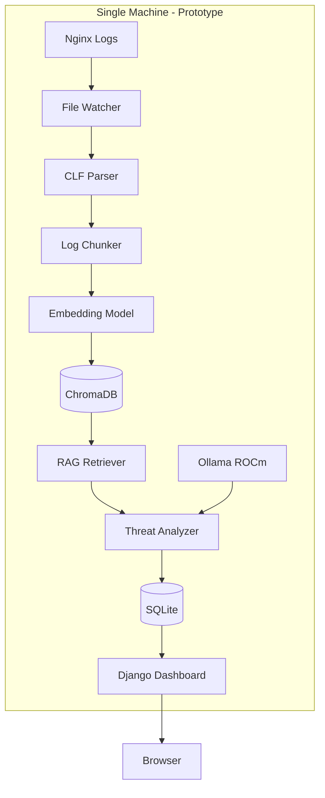
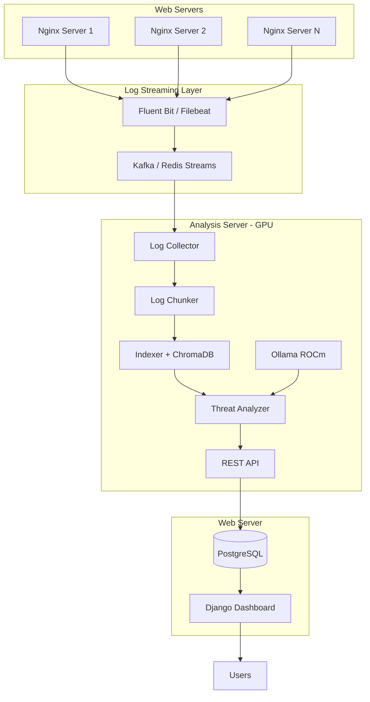
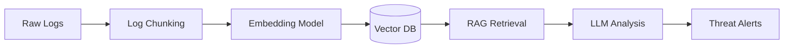

# LoguardLLM: RAG-Powered Log Threat Detection System

**Phase 1: Problem Definition and Proposed Solution**

**Course**: IT Security and Cybersecurity [COSC3796]

**Project Option**: B - Practical Implementation

**Team Members**: [Abhai Sasidharan, Jay Dudhwala, Kunj Yogeshkumar Patel]

---

## Executive Summary

We are trying to build a prototype of an intelligent security monitoring tool that leverages Large Language Models (LLMs) and Retrieval-Augmented Generation (RAG) to detect cybersecurity threats in web server logs. Unlike traditional rule-based systems, LoguardLLM uses semantic understanding to identify both known attack patterns and novel threats that might evade signature-based detection.

This project addresses the growing challenge of analyzing massive volumes of log data in real-time, where human analysts cannot keep pace with the scale and sophistication of modern cyber attacks.

---

## 1. Problem Statement

### 1.1 The Challenge

Web applications face constant security threats including brute force attacks, SQL injection, DDoS attempts, and reconnaissance activities. These threats leave traces in server logs, but identifying malicious patterns among millions of legitimate requests is a significant challenge:

**Current Limitations:**

1. **Volume Overload**: High-traffic websites generate millions of log entries daily, making manual analysis impossible
2. **Rule-Based Limitations**: Traditional SIEM tools rely on predefined rules and signatures, missing novel or obfuscated attacks
3. **Context Loss**: Log aggregation and summarization lose critical details needed for accurate threat assessment
4. **False Positives**: Overly sensitive rules generate alert fatigue, causing real threats to be overlooked
5. **Delayed Detection**: Batch processing introduces latency between attack occurrence and detection

Since the advent of AI there has been a surge in cyber security attacks. A report by Check Point Software Technologies Ltd. (NASDAQ: CHKP) reveals that organizations experienced an average of 1,968 cyber attacks per week in 2025, representing a 70% increase since 2023, as attackers increasingly leverage automation and AI to move faster, scale more easily, and operate across multiple attack surfaces simultaneously.

### 1.2 The Opportunity

Recent advances in Large Language Models enable semantic understanding of text, including log entries. By combining LLMs with RAG (Retrieval-Augmented Generation), we can:

- Analyze logs with human-like contextual understanding
- Detect novel attack patterns without predefined signatures
- Intelligently select the most relevant logs from millions of entries while preserving their full fidelity
- Provide natural language explanations of detected threats

### 1.3 Research Questions

1. Can LLMs effectively detect security threats in web server logs with acceptable accuracy?
2. How does RAG-based semantic retrieval with log chunking compare to traditional aggregation for threat detection?
3. What is the optimal chunking strategy (fixed-size vs. time-window) for capturing attack patterns?
4. What is the false positive rate compared to rule-based systems?
5. Is real-time analysis feasible with local LLM inference on consumer GPUs?

---

## 2. Case Study: Drupalgeddon 2.0 (CVE-2018-7600)

### 2.1 Overview

In March 2018, a critical remote code execution vulnerability was discovered in Drupal CMS (CVE-2018-7600), affecting versions 7.x and 8.x. This vulnerability, dubbed "Drupalgeddon 2.0," allowed unauthenticated attackers to execute arbitrary code on vulnerable servers.

**Timeline:**
- **March 28, 2018**: Vulnerability disclosed, patch released (Drupal 7.58, 8.3.9, 8.4.6, 8.5.1)
- **April 12-13, 2018**: Mass exploitation begins
- **Within 48 hours**: Over 115,000 Drupal sites compromised
- **June 2018**: Two months later, 115,000+ sites still vulnerable
- **October 2018**: Attacks continue against unpatched installations

### 2.2 Real-World Impact: Affected Organizations

Drupalgeddon 2.0 compromised numerous high-profile organizations across government, education, and commercial sectors:

**Government & Public Sector:**
- Colorado Attorney General's office
- US National Labor Relations Board
- Arizona Board of Behavioral Health Examiners
- Police department website in Belgium
- Turkish Revenue Administration
- Social Security Institute of the State of Mexico and Municipalities

**Education:**
- UCLA (University of California, Los Angeles)
- Peru's Project Improvement of Higher Education Quality
- Major educational institutions across the United States

**Commercial & Entertainment:**
- San Diego Zoo
- Lenovo (computer hardware manufacturer)
- Large television networks
- Mass media and entertainment conglomerates

**Scale of Compromise:**
- Over 1 million Drupal sites initially vulnerable
- 115,070 sites confirmed vulnerable two months after patch
- Additional 225,056 sites with unverifiable versions
- 250+ websites affected by cryptojacking campaigns alone

**Attack Payloads Deployed:**
- Coinhive Monero cryptocurrency miners (80% CPU usage)
- Backdoors for persistent access
- Shellbot malware
- IoT botnet malware
- Command-and-control infrastructure

### 2.3 Attack Characteristics

The exploit targeted Drupal's Form API, allowing attackers to inject malicious code through specially crafted POST requests:

```
POST /user/register?element_parents=account/mail/%23value&ajax_form=1&_wrapper_format=drupal_ajax HTTP/1.1
Host: vulnerable-site.com
Content-Type: application/x-www-form-urlencoded

form_id=user_register_form&_drupal_ajax=1&mail[#post_render][]=exec&mail[#type]=markup&mail[#markup]=echo%20HACKED
```

**Log Signatures:**
- POST requests to `/user/register`, `/user/password`, or `/node/*` endpoints
- Unusual query parameters: `element_parents`, `ajax_form`, `_wrapper_format`
- Form field manipulation with `#post_render`, `#lazy_builder`, `#pre_render`
- Suspicious payloads in form data (shell commands, file operations)

### 2.4 Detection Challenges

Traditional signature-based detection faced several challenges:

1. **Obfuscation**: Attackers URL-encoded payloads and used various parameter combinations
2. **Legitimate Traffic Overlap**: Normal Drupal form submissions looked similar
3. **Volume**: Automated scanners generated thousands of requests per minute
4. **Variants**: Multiple exploit variations emerged within days

### 2.5 How LoguardLLM Would Help

LoguardLLM's RAG-based approach would detect Drupalgeddon attacks through:

1. **Semantic Pattern Recognition**: LLM understands that `#post_render` + `exec` + form submission = code execution attempt
2. **Intelligent Context Selection**: RAG retrieves the most relevant request details with full fidelity, not aggregated summaries
3. **Anomaly Detection**: Unusual parameter combinations flagged even without exact signatures
4. **Natural Language Alerts**: "Detected potential remote code execution via Drupal Form API manipulation"

**Example Detection Scenario:**

```
Retrieved Logs (via RAG):
- POST /user/register?element_parents=account/mail/%23value 401
- POST /user/register?element_parents=account/mail/%23value 401
- POST /user/register?element_parents=account/mail/%23value 200

LLM Analysis:
"Multiple POST requests to user registration endpoint with suspicious
'element_parents' parameter containing URL-encoded '#value'. Pattern
consistent with Drupalgeddon 2.0 (CVE-2018-7600) exploitation attempt.
Final request succeeded (200), indicating potential compromise."

Threat Type: Remote Code Execution
Severity: Critical
Confidence: 0.92
```

### 2.6 Lessons Learned

This case study demonstrates:

- **Speed Matters**: Attacks spread rapidly; real-time detection is critical (115,000+ sites compromised within 48 hours)
- **Signatures Aren't Enough**: Obfuscation and variants evade simple pattern matching
- **Context Is Key**: Understanding request structure and parameters is essential
- **Adaptability Required**: New vulnerabilities emerge constantly; systems must adapt quickly
- **High-Value Targets**: Government, education, and commercial organizations all vulnerable
- **Persistent Threats**: Attacks continued for months against unpatched systems
- **Multiple Attack Stages**: Initial compromise followed by malware deployment (cryptominers, backdoors, botnets)

---

## 3. Related Work and Existing Solutions

### 3.1 Traditional SIEM Tools

**Splunk, ELK Stack (Elasticsearch, Logstash, Kibana), Graylog**

**Approach**: Rule-based pattern matching, statistical analysis, dashboards

**Strengths:**
- Mature, battle-tested technology
- High throughput (millions of events/second)
- Extensive integration ecosystem
- Powerful query languages

**Limitations:**
- Require manual rule creation and maintenance
- Struggle with novel or obfuscated attacks
- High false positive rates
- Expensive (Splunk) or complex to manage (ELK)
- Limited semantic understanding

### 3.2 Machine Learning-Based Solutions

**Darktrace, Vectra AI, Exabeam**

**Approach**: Anomaly detection using ML models (clustering, neural networks)

**Strengths:**
- Detect deviations from baseline behavior
- Adapt to environment over time
- Reduce false positives through learning

**Limitations:**
- Require extensive training data
- Black-box models lack explainability
- Struggle with rare attack types
- Expensive enterprise solutions

### 3.3 LLM-Based Security Research

**Recent Academic Work:**

- **"LogPrompt" (2023)**: Uses GPT-3.5 for log anomaly detection, but focuses on system logs, not security threats
- **"SecLLM" (2024)**: Fine-tunes LLMs for vulnerability detection in code, not runtime log analysis
- **"LLM-IDS" (2024)**: Proposes LLM-based intrusion detection but uses log summarization (loses detail)

**Gap in Literature:**

No existing work combines:
1. RAG for intelligent semantic selection of log entries under context constraints
2. Local LLM inference (privacy, cost)
3. Real-time web server log analysis
4. Practical implementation on consumer hardware

### 3.4 LoguardLLM's Novel Contributions

| Feature | Traditional SIEM | ML-Based IDS | LoguardLLM |
|---------|------------------|--------------|------------|
| **Semantic Understanding** | ❌ | Partial | ✅ |
| **Novel Threat Detection** | ❌ | ✅ | ✅ |
| **Explainability** | ✅ | ❌ | ✅ |
| **Intelligent Context Selection** | ❌ | ❌ | ✅ (via RAG) |
| **No Training Data Required** | ✅ | ❌ | ✅ |
| **Adaptable via Prompts** | ❌ | ❌ | ✅ |
| **Privacy (Local Inference)** | Varies | ❌ | ✅ |
| **Cost** | High | High | Low (open-source) |

---

## 4. Proposed Solution: LoguardLLM

### 4.1 System Overview

LoguardLLM is a Python-based security monitoring tool that:

1. **Collects** logs from web servers (like nginx, apache) in real-time
2. **Indexes** log entries using semantic embeddings (vector database)
3. **Retrieves** relevant logs using RAG when analyzing for threats
4. **Analyzes** retrieved logs with a local LLM (Mistral 7B on AMD GPU)
5. **Alerts** on detected threats with explanations and recommendations
6. **Presents** findings via Django web dashboard with authentication

### 4.2 Architecture

#### 4.2.1 Prototype Architecture (Demo)

For demonstration purposes, all components run on a single machine with GPU access:



#### 4.2.2 Production Architecture (Real-world Deployment)

In a production environment, components would be distributed across multiple servers:



**Architectural Rationale:**

| Component | Prototype | Production | Reason |
|-----------|-----------|------------|--------|
| **Log Collection** | Local file watcher | Fluent Bit → Kafka | Web servers rarely have GPUs; streaming enables multi-source collection |
| **Database** | SQLite | PostgreSQL | SQLite sufficient for demo; production needs concurrent access |
| **Deployment** | Single machine | Distributed | LLM inference requires dedicated GPU hardware |
| **Scalability** | Single log source | Multiple servers | Real deployments monitor many servers simultaneously |

### 4.3 Technical Components

#### 4.3.1 Log Collection and Parsing

**Supported Format**: Common Log Format (CLF) and NCSA Extended/Combined

```
192.168.1.100 - - [31/Jan/2026:10:15:23 +0000] "POST /user/login HTTP/1.1" 401 1234 "http://example.com" "Mozilla/5.0..."
```

**Parsed Fields**:
- Client IP address
- Timestamp
- HTTP method and path
- Status code
- Response size
- Referer
- User agent

**Extensibility**: Abstract parser interface allows adding Apache, Syslog, Log4j formats in future phases.

#### 4.3.2 RAG-Based Indexing and Retrieval

**Why RAG?**

Traditional log analysis either:
1. **Aggregates** logs (e.g., "47 failed logins from IP X") → loses detail
2. **Sends all logs** to LLM → exceeds context window

**RAG enables selective context construction**, retrieving only the most semantically relevant log entries while preserving their full fidelity for LLM analysis. This approach dramatically reduces token usage while improving detection accuracy by focusing on relevant patterns.

**RAG Pipeline:**



**Log Chunking Strategy:**

Instead of embedding individual log lines, we group logs into semantically meaningful chunks to capture temporal attack patterns:

**Two Chunking Strategies:**

1. **Fixed-Size Chunks**: Group 5-10 consecutive log entries per chunk
   - Captures sequential patterns (e.g., reconnaissance → exploitation)
   - Reduces embedding overhead

2. **Time-Window Chunks**: Group all logs within a 1-minute window
   - Captures temporal attack patterns (e.g., brute-force attempts)
   - Better for rate-based anomalies

**Why Chunking?**

- **Temporal Context**: Attacks often span multiple log entries (e.g., 47 failed logins)
- **Efficiency**: Fewer embeddings to store and search (100 logs → 10-20 chunks)
- **Pattern Recognition**: LLM sees related events together, not isolated lines

**Indexing Process:**

```python
# Chunk logs by time window (1 minute)
chunks = group_logs_by_time_window(logs, window_seconds=60)

for chunk in chunks:
    # Create semantic representation of chunk
    chunk_text = "\n".join([
        f"{log.method} {log.path} | Status:{log.status} | IP:{log.ip}"
        for log in chunk.logs
    ])

    # Generate embedding for the chunk
    embedding = embedding_model.embed(chunk_text)  # [0.12, -0.45, 0.78, ...]

    # Store chunk embedding with metadata
    chromadb.store(
        embedding=embedding,
        document=chunk_text,
        metadata={
            "start_time": chunk.start_time,
            "end_time": chunk.end_time,
            "log_count": len(chunk.logs),
            "unique_ips": chunk.unique_ips,
            "status_codes": chunk.status_codes,
            "raw_logs": chunk.logs  # Full fidelity for LLM
        }
    )
```

**Retrieval Strategies:**

1. **Time Window**: Recent chunks (last N minutes)
2. **Semantic Search**: Query for "failed authentication attempts" returns similar chunks
3. **Anomaly Detection**: Chunks with unusual patterns (high error rates, suspicious IPs)

**RAG vs. No-RAG Comparison:**

Analyzing 100 log entries:

| Aspect | Without RAG | With RAG |
|--------|-------------|----------|
| **Logs Processed** | 100 | 100 stored, ~20 retrieved |
| **Tokens Sent to LLM** | ~4,000-6,000 | ~800-1,200 |
| **Focus** | All logs equally | Only relevant logs |
| **Scaling** | Poor beyond hundreds | Excellent (10K+ logs) |
| **Detection Accuracy** | Potentially diluted by noise | Higher (semantic focus) |
| **Latency** | Longer (more tokens) | Shorter (fewer tokens) |

**How RAG Improves Detection:**

By retrieving only semantically relevant log chunks, RAG:
- **Reduces noise**: LLM focuses on suspicious patterns, not benign traffic
- **Improves accuracy**: Relevant context leads to better threat assessment
- **Enables scale**: Can analyze millions of logs by retrieving only hundreds
- **Preserves detail**: Retrieved chunks contain full log fidelity for reasoning

**Example Scenario:**

```
Scenario: 10,000 logs in last hour, 47 suspicious login attempts

Without RAG:
- Send all 10,000 logs → 40,000+ tokens → exceeds context window
- Solution: Aggregate to "47 failed logins from IP X" → loses detail

With RAG:
1. Index 10,000 logs as ~1,000 chunks (10 logs per chunk)
2. Query: "failed authentication brute force attempts"
3. Retrieve: 5 most relevant chunks (~50 logs, ~2,000 tokens)
4. LLM sees full details: timestamps, paths, user agents, patterns
5. Result: "Brute force attack detected - 47 failed login attempts to
   /user/login from IP 192.168.1.50 over 5 minutes. User agents vary,
   suggesting automated tool. Recommend IP block."
```

#### 4.3.3 LLM Inference

**Model**: Mistral 7B Instruct (quantized Q8)

**Hardware**: AMD RX 9070 XT (16GB VRAM) via Ollama with ROCm support

**Inference Flow:**

```python
PROMPT = """
Analyze these web server logs for security threats.

Retrieved Logs:
{log_entries}

Identify any threats. For each, provide:
- type: brute_force | ddos | injection | traversal | reconnaissance | bot
- severity: critical | high | medium | low
- confidence: 0.0-1.0
- description: Brief explanation
- evidence: Specific log entries
- recommendation: Suggested action

Respond in JSON format.
"""

response = ollama.generate(prompt)
threats = parse_json(response)
```

**Why Local LLM?**

- **Privacy**: Logs contain sensitive data (IPs, paths, user agents)
- **Cost**: Cloud APIs expensive at scale (millions of logs)
- **Latency**: Local inference faster than API calls
- **Control**: Can switch models, adjust prompts, fine-tune

#### 4.3.4 Threat Detection Categories

| Threat Type | Detection Signals |
|-------------|-------------------|
| **Brute Force** | Multiple 401/403 responses to login endpoints from same IP |
| **DDoS/DoS** | High request rate from single or distributed IPs |
| **SQL Injection** | `union`, `select`, `'--`, `or 1=1` in query strings |
| **Path Traversal** | `../`, `/etc/passwd`, `%2e%2e%2f` in paths |
| **Reconnaissance** | Many 404 responses, scanning patterns, unusual user agents |
| **Bot Activity** | Suspicious user agents, rapid sequential requests |

#### 4.3.5 Dashboard and Alerting

**Django Web Application:**

- **Authentication**: Single admin user (Django's built-in auth)
- **Database**: SQLite (stores configs, analysis runs, threat alerts)
- **Pages**:
  - Home: Overview metrics (total threats, recent runs, status)
  - Threats: List of detected threats with filtering
  - Config: Adjust analysis interval, log paths, LLM model

**Models:**

```python
class Config(models.Model):
    analysis_interval_seconds = models.IntegerField(default=60)
    max_logs_per_analysis = models.IntegerField(default=100)
    log_file_path = models.CharField(max_length=500)
    llm_model = models.CharField(default="mistral:7b-instruct")

class AnalysisRun(models.Model):
    timestamp = models.DateTimeField(auto_now_add=True)
    logs_analyzed = models.IntegerField()
    threats_found = models.IntegerField()
    duration_seconds = models.FloatField()

class ThreatAlert(models.Model):
    analysis_run = models.ForeignKey(AnalysisRun)
    threat_type = models.CharField(max_length=50)
    severity = models.CharField(max_length=20)
    confidence = models.FloatField()
    description = models.TextField()
    evidence = models.JSONField()  # List of log entries
    recommendation = models.TextField()
```

### 4.4 Technology Stack

- **Language**: Python 3.11+
- **Web Framework**: Django 5.x
- **LLM Runtime**: Ollama with ROCm (AMD GPU support)
- **LLM Model**: Mistral 7B Instruct Q8 (~8GB VRAM)
- **Embedding Model**: nomic-embed-text (~1GB VRAM)
- **Vector Database**: ChromaDB (embedded)
- **Database**: SQLite
- **Log Monitoring**: watchdog library
- **Deployment**: Docker Compose

---

## 5. Implementation Plan

### 5.1 Phase 1: Problem Definition (Current)

**Deliverables:**
- ✅ Project proposal (this document)
- ✅ Case study analysis (Drupalgeddon 2.0)
- ✅ Literature review
- ✅ Architecture design

### 5.2 Phase 2: Implementation (Due March 6, 2026)

**Weeks 1-2: Core Engine**
- Django project setup
- CLF log parser implementation
- Log chunking implementation (fixed-size and time-window strategies)
- ChromaDB indexing with chunk embeddings
- Ollama LLM integration

**Weeks 3-4: Analysis and Dashboard**
- RAG retrieval implementation with semantic search
- Threat detection prompts and logic
- Django dashboard with authentication
- Alert storage and display

**Deliverables:**
- Working prototype
- Mid-term progress report
- Demo video

### 5.3 Phase 3: Evaluation (Due April 3, 2026)

**Testing:**
- Set up Drupal site with Nginx
- Generate normal traffic baseline
- Simulate attacks:
  - Brute force login attempts
  - SQL injection payloads
  - Path traversal attempts
  - DDoS simulation
- Measure detection accuracy and false positive rate

**Comparison:**
- Benchmark against rule-based detection
- Compare chunking strategies (fixed-size vs. time-window)
- Test multiple LLM models (Mistral 7B, Llama 3.1 8B, Qwen2.5 14B)
- Analyze performance (latency, throughput, token efficiency)

**Deliverables:**
- Evaluation report
- Final presentation
- Live demonstration

---

## 6. Expected Outcomes and Impact

### 6.1 Research Contributions

1. **Novel Approach**: First practical implementation of RAG with log chunking + local LLM for web server log threat detection
2. **Chunking Strategy Analysis**: Empirical comparison of fixed-size vs. time-window chunking for attack pattern detection
3. **Empirical Data**: Quantitative comparison of LLM-based vs. rule-based detection with token efficiency metrics
4. **Open Source**: Codebase available for community use and extension

### 6.2 Practical Benefits

**For Small Organizations:**
- Affordable security monitoring (no expensive SIEM licenses)
- Runs on consumer hardware (no cloud costs)
- Easy deployment (Docker Compose)

**For Researchers:**
- Extensible framework for log analysis research
- Pluggable LLM backend (test different models)
- Benchmark dataset for evaluation

**For Security Teams:**
- Reduced false positives through semantic understanding
- Natural language threat explanations (easier to understand)
- Adaptable to new threats via prompt engineering

### 6.3 Success Metrics

| Metric | Target |
|--------|--------|
| **Detection Accuracy** | >85% on simulated attacks |
| **False Positive Rate** | <10% on normal traffic |
| **Analysis Latency** | <30 seconds per batch (100 logs) |
| **Throughput** | Handle 1000+ logs/minute |

---

## 7. Risks and Mitigation

### 7.1 Technical Risks

**Risk**: LLM hallucinates threats (false positives)
**Mitigation**: Confidence scoring, human review workflow, prompt engineering

**Risk**: RAG retrieval misses relevant logs
**Mitigation**: Multiple retrieval strategies (time-window, semantic similarity, anomaly detection), embedding model tuning, retrieval parameter optimization

**Risk**: GPU memory limitations
**Mitigation**: Model quantization (Q8, Q4), batch size tuning

**Risk**: Real-time performance insufficient
**Mitigation**: Async processing, configurable analysis intervals

### 7.2 Project Risks

**Risk**: Drupal site setup complexity
**Mitigation**: Use Docker image, pre-configured test environment

**Risk**: Limited time for evaluation
**Mitigation**: Prioritize core functionality, automate testing

**Risk**: ROCm compatibility issues (AMD GPU)
**Mitigation**: Ollama handles ROCm abstraction, fallback to CPU if needed

---

## 8. Conclusion

LoguardLLM represents a novel approach to cybersecurity log analysis, combining the semantic understanding of Large Language Models with the intelligent context selection capabilities of Retrieval-Augmented Generation. By addressing the limitations of traditional rule-based systems while remaining practical and affordable, this project has the potential to make advanced threat detection accessible to organizations of all sizes.

The Drupalgeddon 2.0 case study demonstrates the critical need for adaptive, context-aware security monitoring. LoguardLLM's ability to understand attack patterns semantically, rather than relying solely on signatures, positions it to detect both known and novel threats effectively.

Through this three-phase implementation, we will not only build a functional prototype but also contribute empirical data on the effectiveness of LLM-based security analysis, paving the way for future research and practical deployments.

---

## References

1. Drupal Security Team. (2018). "SA-CORE-2018-002 - Drupal core - Highly critical - Remote Code Execution." https://www.drupal.org/sa-core-2018-002

2. Checkpoint Research. (2018). "Drupalgeddon 2: Profiting from Mass Exploitation." https://research.checkpoint.com/2018/uncovering-drupalgeddon-2/

3. The Hacker News. (2018). "Over 115,000 Drupal Sites Still Vulnerable to Drupalgeddon2 Exploit." https://thehackernews.com/2018/06/drupalgeddon2-exploit.html

4. Threatpost. (2018). "Drupalgeddon 2.0 Still Haunting 115K+ Sites." https://threatpost.com/drupalgeddon-2-0-still-haunting-115k-sites/132518/

5. Ars Technica. (2018). "Hundreds of big-name sites hacked, converted into drive-by currency miners." https://arstechnica.com/information-technology/2018/05/hundreds-of-big-name-sites-hacked-converted-into-drive-by-currency-miners/

6. OWASP. (2021). "OWASP Top Ten Web Application Security Risks." https://owasp.org/www-project-top-ten/

7. Splunk. (2024). "Security Information and Event Management (SIEM) Best Practices." https://www.splunk.com/en_us/blog/learn/siem-security-information-event-management.html

8. Gao, Y., et al. (2023). "LogPrompt: Prompt Engineering for Log Anomaly Detection." arXiv:2308.07610. https://arxiv.org/abs/2308.07610

9. Chen, X., et al. (2024). "Large Language Models for Intrusion Detection Systems: A Survey." IEEE Security & Privacy.

10. Ollama. (2024). "Run Llama 3.1, Mistral, and other models locally." https://ollama.ai/

11. ChromaDB. (2024). "The AI-native open-source embedding database." https://www.trychroma.com/

12. Check Point Software. (2026). "Check Point Software's 2026 Cyber Security Report Shows Global Attacks Reach Record Levels as AI Accelerates the Threat Landscape." https://www.checkpoint.com/press-releases/check-point-softwares-2026-cyber-security-report-shows-global-attacks-reach-record-levels-as-ai-accelerates-the-threat-landscape/

13. Axis Insurance. (2025). "A.I.-Driven Cyberattacks Fuel 149% Rise in Ransomware Incidents in Early 2025." https://axisinsurance.ca/a-i-driven-cyberattacks-fuel-149-rise-in-ransomware-incidents-in-early-2025-our-advice-for-staying-ahead-of-the-next-breach/

14. AccuKnox. (2025). "AI Attacks on the Rise." https://accuknox.com/blog/ai-attacks-on-the-rise
